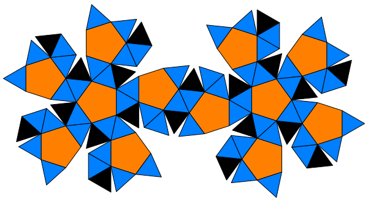

<!-- ABOUT THE PROJECT -->

# Servidor de configura&ccedil;&atilde;o autom&aacute;tica (ACS) como ferramenta para um sistema multiagentes (MAS).

## Monitorar, detectar e previnir atividades maliciosas relacionadas ao abuso de privil&eacute;gios, com o objetivo de reduzir a superf&iacute;cie de ataque.

# ...em desenvolvimento

_Atendendo a privacidade de dados conforme &agrave; Lei Geral de Prote&ccedil;&atilde;o de Dados, lei nº 13.709/2018. Caso n&atilde;o tenha interesse em manter suas informa&ccedil;&otilde;es pessoais em nosso banco de dados, solicitamos nos encaminhar um e-mail para dpo@rekall.log.br._

---

- Sou usu&aacute;rio de FreeBSD e defensor do software livre.
- Aberto a discutir sistemas embarcados ou projetos envolvendo telemetria.

_Sou tecn&oacute;logo de redes de computadores dedicado em criar c&oacute;digo de baixo n&iacute;vel, confi&aacute;vel, eficiente e bem projetado. Para mim, C &eacute; a ferramenta perfeita para construir software que n&atilde;o seja apenas perform&aacute;tico, mas tamb&eacute;m seguro e elegante desde a sua concep&ccedil;&atilde;o._

---

