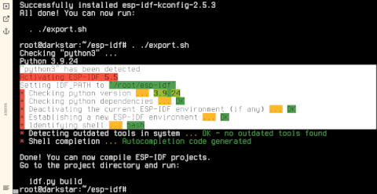
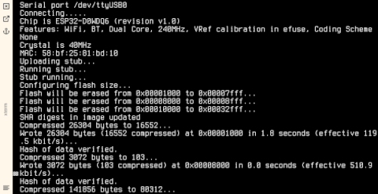
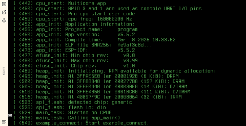
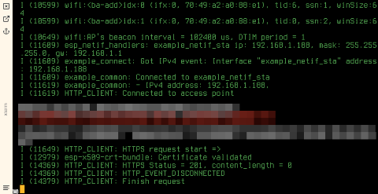
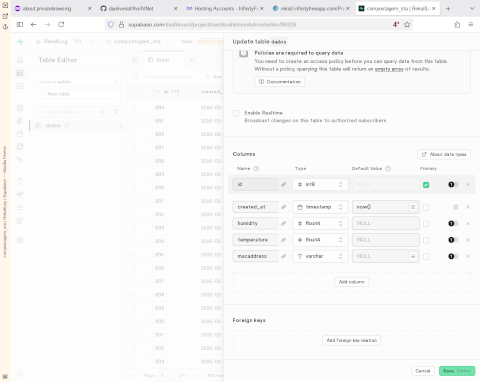
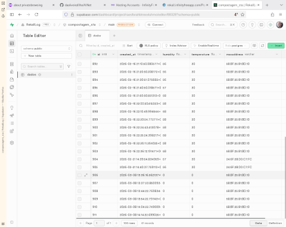

_Tecn&oacute;logo de redes de computadores dedicado em criar c&oacute;digo de baixo n&iacute;vel, confi&aacute;vel, eficiente e bem projetado. Para mim, C &eacute; a ferramenta perfeita para construir software que n&atilde;o seja apenas perform&aacute;tico, mas tamb&eacute;m seguro e elegante desde a sua concep&ccedil;&atilde;o._

<!-- ABOUT THE PROJECT -->
# AINet

### Aquisi&ccedil;&atilde;o de dados com um modelo de implanta&ccedil;&atilde;o flex&iacute;vel e um conjunto de pol&iacute;ticas e procedimentos que atuam na continuidade, recupera&ccedil;&atilde;o de ambientes e replica&ccedil;&atilde;o de dados armazenados, suportando aplica&ccedil;&otilde;es de TI de modo que permane&ccedil;am est&aacute;veis.

### Eliminando a complexidade dos gateways tradicionais e entregando seus dados diretamente em uma infraestrutura distribu&iacute;da assegurando performance e escalabilidade.

---

- Sou usu&aacute;rio de FreeBSD e defensor do software livre.
- Aberto a discutir sistemas embarcados ou projetos envolvendo telemetria.

---

